# Supplementary Material Analysis

This document tracks the progress and results of reproducing figures from the supplementary material of the paper "Quantum Machine Learning for Classical Data Analysis: Euclidean, Spherical, and Gauge".

## Supplementary Figure 1: Noisy Circle Reconstruction

This figure investigates the effect of the quantum fluctuation weight `w_qf` on reconstructing points sampled from a noisy circle (D=2, true_dim=1). The training uses N=4, noise=0.1, and a commutation penalty. Matrix normalization after each step was initially used but later removed as it prevented convergence to the correct radius.

**Key Findings:**

*   **`w_qf = 0.0` (No Fluctuation Term, No Normalization):** The model overfits to the noisy input, resulting in a fuzzy reconstructed ring rather than a clean circle. The denoising effect is lost without normalization or the fluctuation term.
*   **`w_qf = 0.2`:** The reconstruction forms a much cleaner circle, close to radius 1. The quantum fluctuation term acts as a regularizer, providing the denoising effect. Matches Fig S1(b).
*   **`w_qf = 0.4, 0.6, 0.8`:** The reconstructed shape progressively deforms from a circle towards a square-like shape, consistent with Figs S1(c-e).
*   **`w_qf = 1.0`:** The reconstructed points collapse towards four distinct regions, matching the behavior shown in Fig S1(f). Achieving tight clusters required tuning (e.g., lower learning rate, potentially more epochs).

**Implementation:** See `qgml/quantum/test_supp.py`.
**Outputs:** Figures are saved in `test_outputs/supp_figure1/`. Includes reconstruction plots and training curves.

### Figure S1 Plots

**w=0.0**
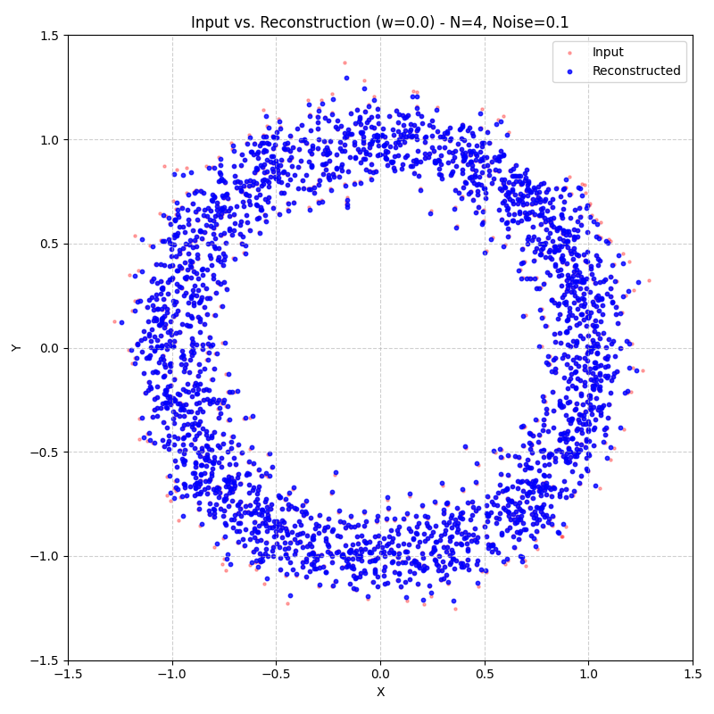
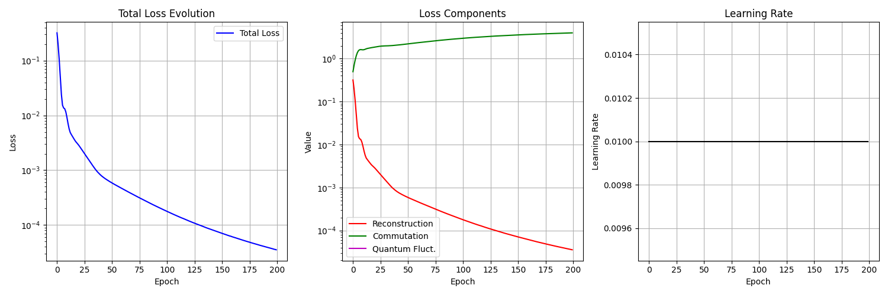

**w=0.2**
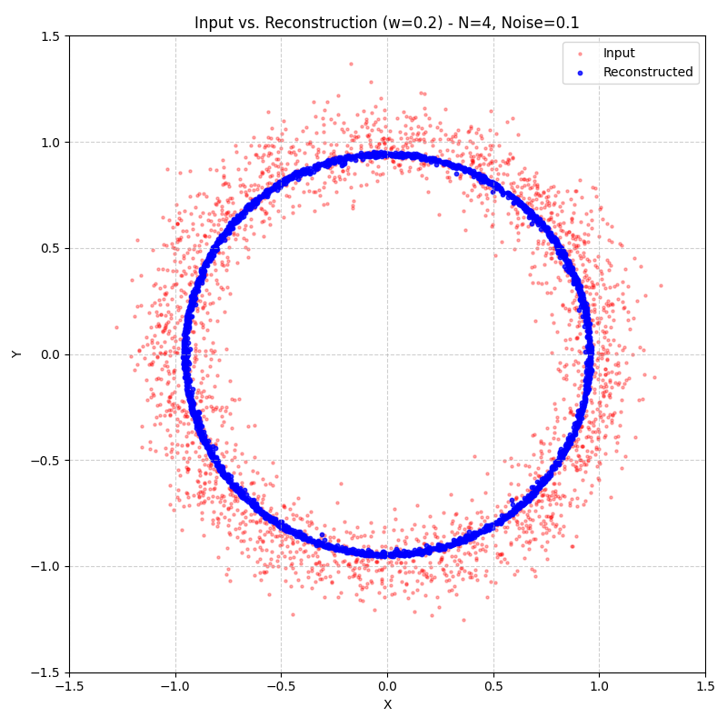
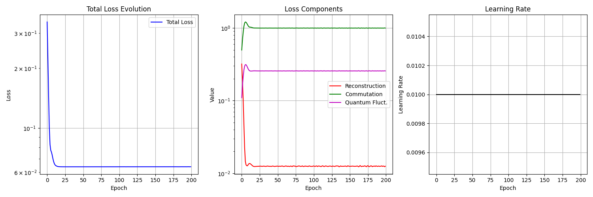

**w=0.4**
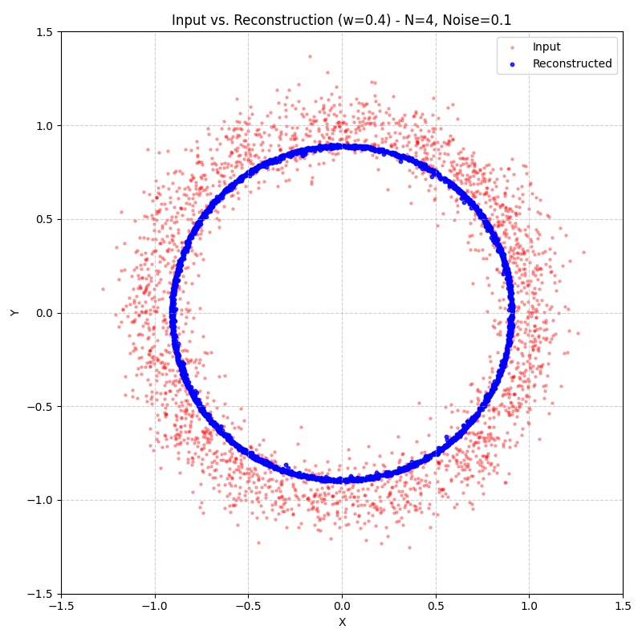
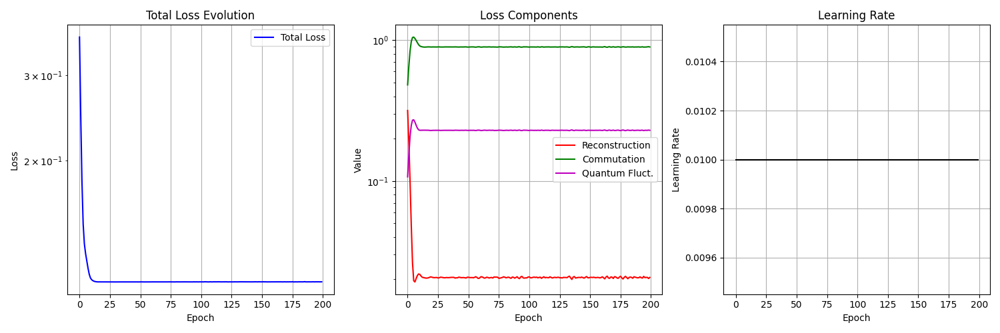

**w=0.6**

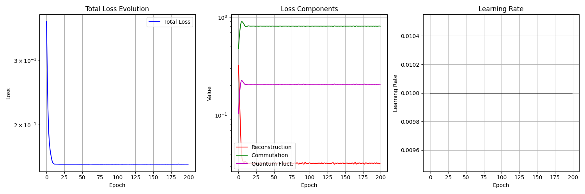

**w=0.8**
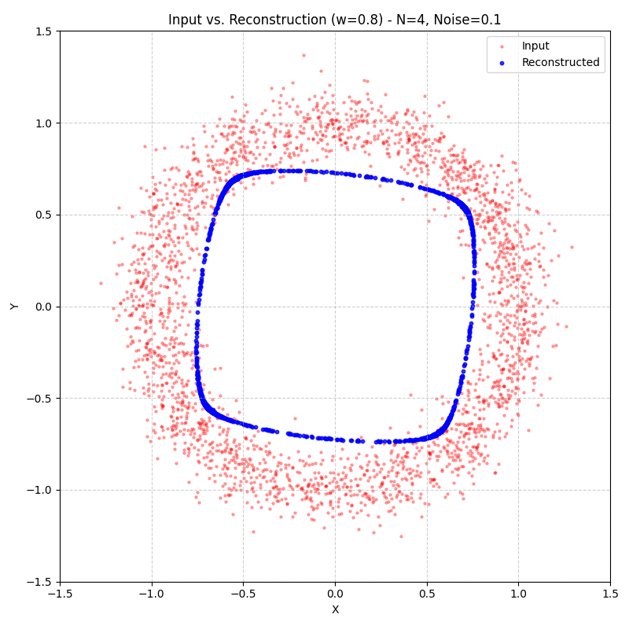
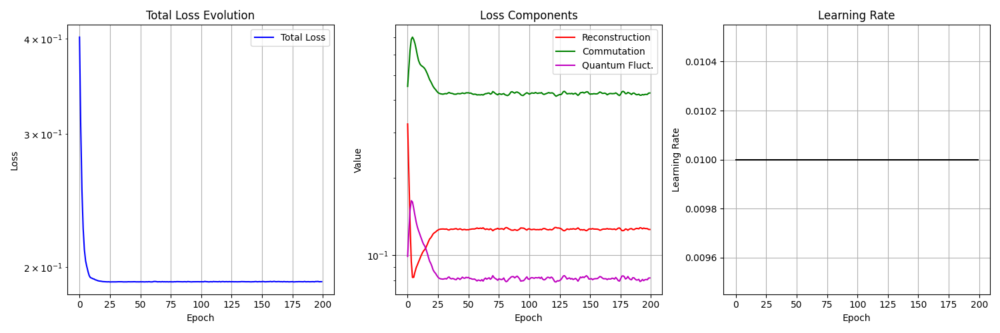

**w=1.0**

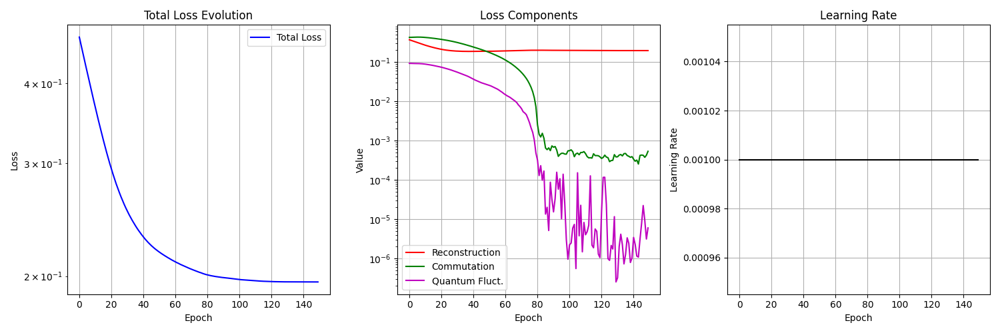

## Supplementary Figure 2: Swiss Roll Reconstruction (N=3 vs N=4)

This figure compares the reconstruction of a noiseless Swiss roll dataset (D=3, true_dim=2) using different Hilbert space dimensions (N=3 and N=4). The paper states these examples used `w=0` and only trained the "bias term" (reconstruction error), implying no commutation penalty.

**Setup:**

*   Dataset: Scikit-learn `make_swiss_roll` (n=2500, noise=0.0).
*   Training: `w_qf = 0.0`, `commutation_penalty = 0.0`. Ran for 2000 epochs.
*   Metric: Sum-over-states (Eq. 7) used for eigenvalue analysis unless noted.

**Key Findings (N=3):**

*   **Reconstruction (Fig 2a):** The reconstructed point cloud is significantly collapsed compared to the input, indicating N=3 lacks the capacity to represent the Swiss roll geometry accurately when only minimizing reconstruction error. Matches paper description.
*   **Eigenvalue Spectrum (Fig 2b):** Shows a clear spectral gap between \(e_1\) and \(e_2\), correctly identifying the intrinsic dimension \(d=2\). The eigenvalues \(e_0, e_1\) are somewhat noisy.

**Key Findings (N=4):**

*   **Reconstruction (Fig 2c):** The reconstruction is significantly better than N=3, covering the extent of the input data more faithfully, although some distortion remains. This matches the paper's claim of improved expressivity.
*   **Eigenvalue Spectrum (Fig 2d - Sum-over-States Metric):** Shows an *ambiguous* spectral gap. \(e_2\) is noisy and lifted significantly from zero, often overlapping with \(e_1\). This makes reliable dimension estimation difficult, matching the paper's findings.
*   **Eigenvalue Spectrum (Fig 2d - Covariance Metric):** When using the covariance metric (calculated on the same N=4 model trained with penalty=0), the spectrum becomes completely unstructured noise with all eigenvalues overlapping. This highlights the sensitivity of metric calculation methods to the learned matrices, especially when they are highly non-commutative (as occurs when penalty=0).

**Implementation:** See `qgml/quantum/test_supp_figure2.py`.
**Outputs:** Figures are saved in `test_outputs/supp_figure2/`. Includes reconstruction plots and eigenvalue spectra.

### Figure S2 Plots

**N=3**
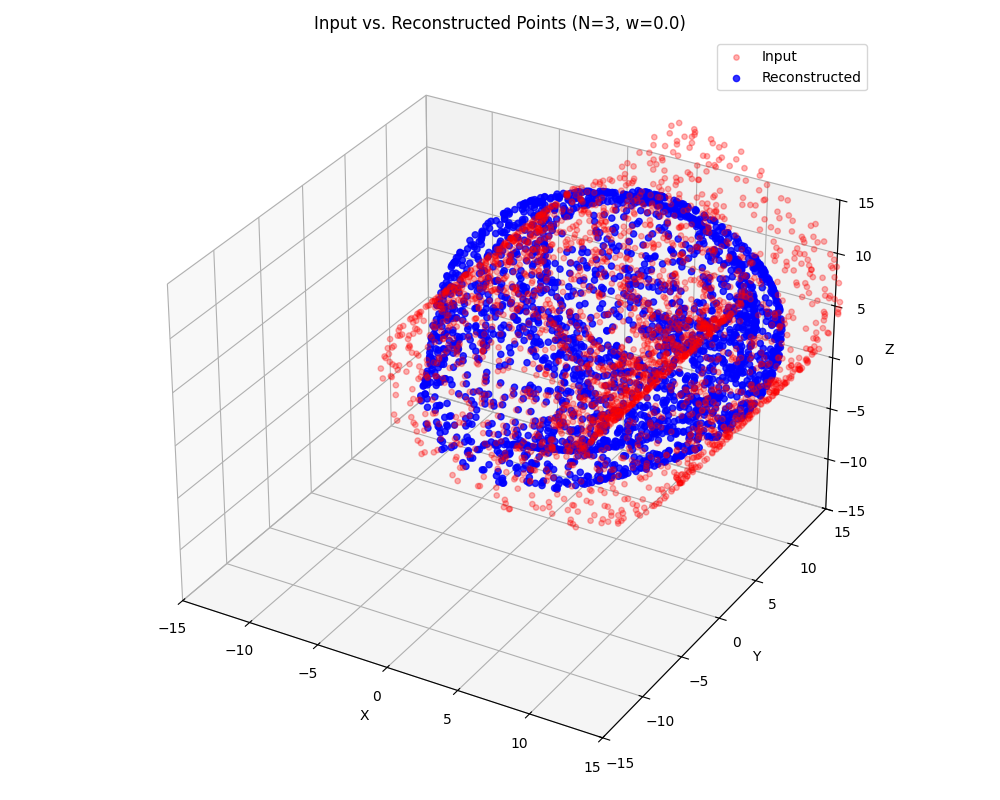
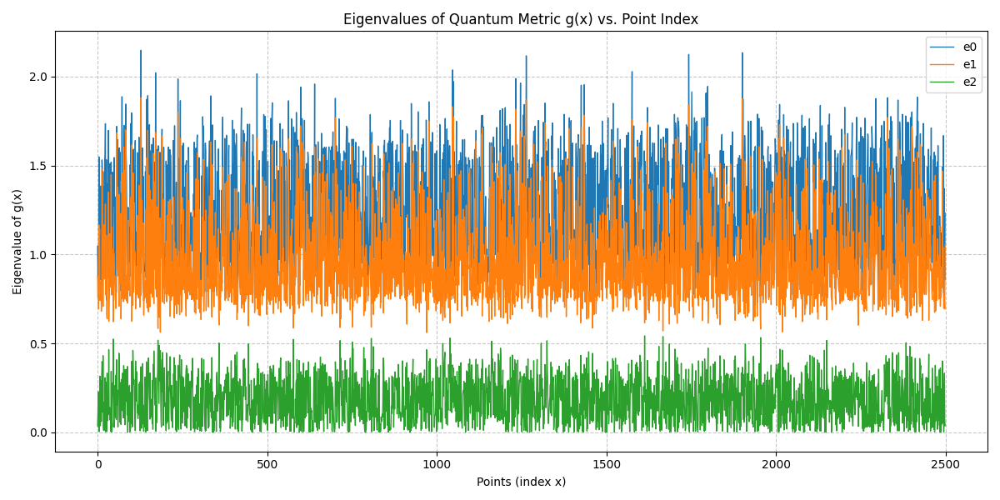

**N=4 (Epoch 800, Penalty=0)**
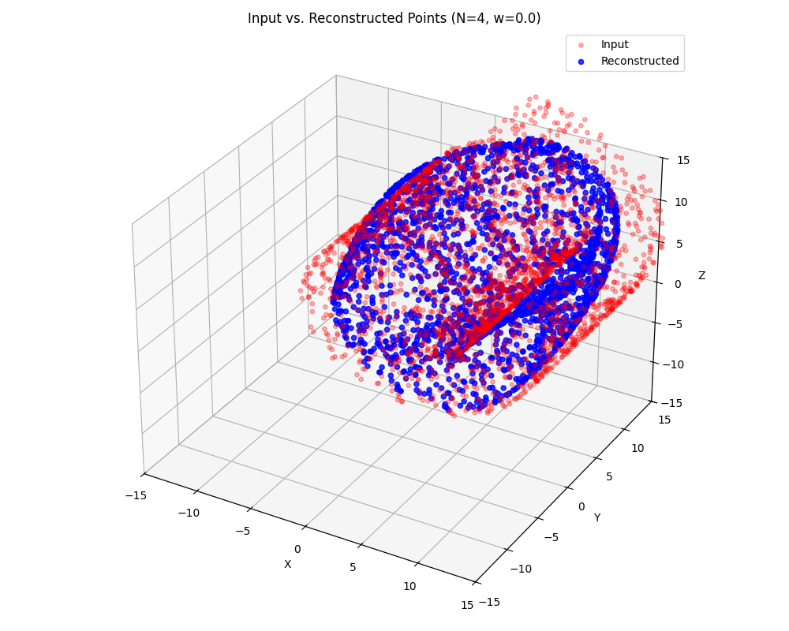
 